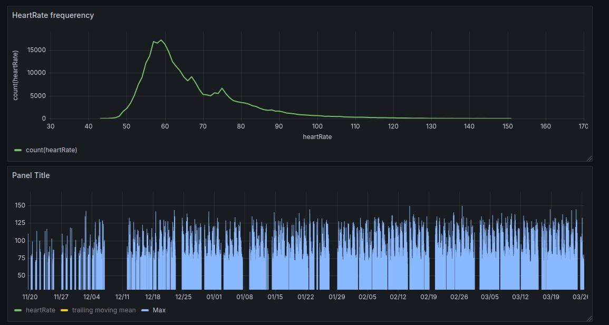
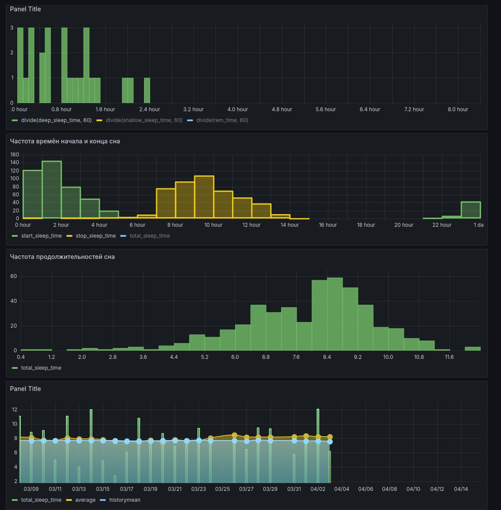

# About
If you have any wearable device from xiaomi/amazfit you can export your sleep, heartbeat and activity hystorical data from your account.
This repo helps you insert this data to clickhouse in order to visualize that information in grafana.

# Installation

```shell

yay -S clickhouse clickhuse-client
yay -S grafana

sudo systemctl enable --now clickhouse-server
sudo systemctl enable --now grafana

```


# Grafana

Grafana default host is your machine hostname, and default port is 3000, so you can access it like this:

```
http://archpc:3000
```

default login/password is admin/admin


# Screemshots




